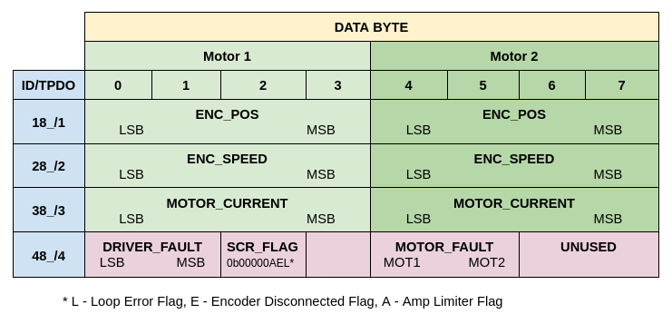
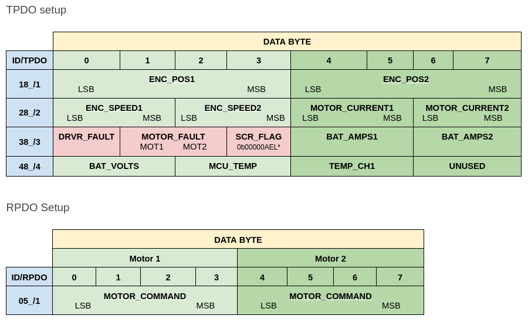
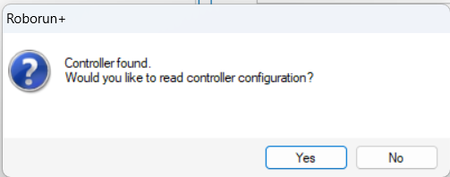
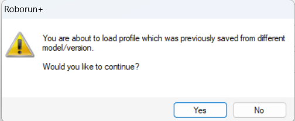

# roboteq-config

The Roboteq controller configuration files for robots with ROS 2 driver. For proper work of ROS driver there is a need to update Roboteq driver firmware (provided by the manufacturer), configuration and script.

Correct configurations:

|                              |          ROS 1 driver          |          ROS 2 driver           |
| ---------------------------: | :----------------------------: | :-----------------------------: |
| **Branch with cofiguration** |              ros1              |              ros2               |
|         **Firmware version** |          v201-111419           |           [v21a-051923](https://www.roboteq.com/docman-list/motor-controllers-documents-and-files/nxtgen-downloads-1/firmware/1112-sbl2xxx-firmware-update-v21a-051923/file)           |
|      **Config file version** |     v2.1-SBL2360T-20230328     | v2.1-SBL2360T-03012024-sin-rpdo |
|      **Script file version** | production_script_02122022.mbs | production_script_03012024.mbs  |

> [!NOTE]
> Currently, this repository contains several tags and releases, such as `Pth v1.20 - ROS 1` and `Pth v0.1-1.06 - ROS 1`, which serve as backups for deprecated configuration versions that were used previously. The latest and most current configurations and scripts are maintained on the `ros1` and `ros2` branches and are compatible with all versions of the robot.

## Understanding the Panther CAN Network with Raspberry Pi and Roboteq Drivers

Roboteq offers a range of firmware versions. The older version, v2.01, has been succeeded by the newer version, v2.1a. The key distinction that stands out for our objectives is the enhancement in torque control achieved through sinusoidal wave modulation, in addition to improved functionalities for configuring RPDO (Receive PDO) and TPDO (Transmit PDO). As a result, the way communications are handled between ROS 1 and ROS 2 drivers varies, with the control mode in the ROS 2 driver being adjustable to accommodate sinusoidal wave control.

**`PDO` Configuration for Firmware Version `v2.01` (Utilized with ROS 1)**

The PDO in this firmware version is mainly configured through scripts due to the inability to set user variables directly in the configuration.

**`PDO` Configuration for Firmware Version `v2.1a` (Utilized with ROS 2)**

The TPDO setup for Roboteq firmware versions newer than 2.1a is predominantly handled through the configuration thanks to an update in functionality.

The exchange of the remaining information is performed via SDO.

Operating Mode Setup via SDO:

- OBJECT ID: 0x2106
- SUB-INDEX: 10
- DATA: op_mode(0-6)
- Operating Modes:
  - 0: Open-loop
  - 1: Closed-loop speed
  - 2: Closed-loop position relative
  - 3: Closed-loop count position
  - 4: Closed-loop position tracking
  - 5: Closed-loop torque
  - 6: Closed-loop speed position

## Roboteq Driver Setup

### Firmware Update

> [!CAUTION]
> - Improper file handling or power loss may damage the controller. Handle with care.
> - This process will revert the configuration settings to default.

**Preliminary Steps**

1. Power up the controller using ROS 2 driver or connect it to a power source (using the GND and + terminals).
2. Connect the controller to a Windows computer using a miniUSB connector.
3. Launch RoboRun+ software.
4. Click `Yes` to read the controller configuration.

**Firmware Update Process**

> [!NOTE]
> You can download the firmware from the links provided in the table at the beginning of the [README.md](README.md).

4. Navigate to the `Console` tab and click on `Update Firmware via USB`.
5. The controller will enter DFU mode and will be recognized as a new USB device (STM DFU). If it's the first time, driver installation might be required.

**Driver Installation (First Time Only)**

6. Open "Device Manager". Under "Other devices", the "STM DFU" device will be marked with an exclamation point.
7. Right-click on "STM DFU" and choose "Update driver" > "Browse my computer for drivers".
8. Direct it to the folder `C:\Program Files (x86)\Roboteq\Roborun Plus\DFU Driver` (default location - may vary). The driver should be detected and installed successfully.

**Continuing Firmware Update**

1. In the DFULoader program, select the appropriate device driver from the list. It may take some time for the computer to recognize the driver. Then, select the correct firmware **(ENSURE IT MATCHES THE MODEL OF YOUR DEVICE!)**.  Click "Upgrade".
2.  After the firmware upload is complete (a "success" message appears), you can restart the controller.
3.  In RoboRun, verify the firmware version (bottom right corner) to ensure the update was successful.

> [!NOTE]
> Repeat these steps for a second driver.

### Configuration update

1. Power up the controller using ROS 2 driver, `pth_motors_on` script, or connect it to a power source (using the GND and + terminals).
2. Connect a USB Mini B cable to the BLDC Motor Driver (one at a time).
3. Launch RoboRun+ software.
4. Click `Yes` to read the controller configuration.
5. In the `Actions` tab, click `Load Profile from Disk`.
6. Choose a configuration file that matches the driver connected to the PC (either front or rear). For example, [this one for the front driver](./configuration/v2.1-SBL2360T-03012024-sin-rpdo-front.cpr).
7. A warning popup might appear. Click `Yes`.

8. In the Actions tab, click `Save to Controller`.

### Roboteq Script Update
1. Navigate to the Console menu tab.
2. In the Configure tab, click on the `Update Script` button.
3. Choose the `.hex` file from the [script](./script/) folder and click `Yes` in the popup window.

This `.hex` file is generated from the [.mbs](./script/production_script_03012024.mbs) file using RoboRun+. If you wish to edit this script, you can do so by navigating to the Scripting menu tab, clicking the `Open` icon, and selecting the `.mbs` file. After making your edits, you can export the modified file to `.hex` format by clicking on the `Export Hex` icon.
