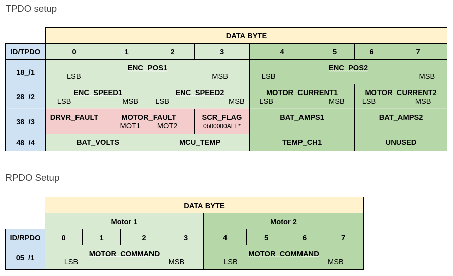
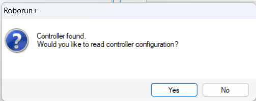
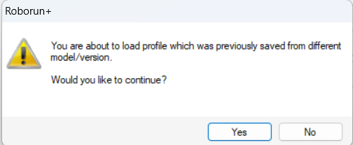

# roboteq-config

The RoboteQ controller configuration files for robots with ROS 2 driver. For proper work of ROS driver there is a need to update RoboteQ driver firmware (provided by the manufacturer), configuration and script.

Correct configurations:
## Panther v1.3
| ROS Version |                                                                              Firmware                                                                              | Config   Front Driver | Config   Rear Driver | Script |
| ----------- | :----------------------------------------------------------------------------------------------------------------------------------------------------------------: | :-------------: | :--------------: | :----: |
| ROS2        | [v30b-022825](https://www.roboteq.com/docman-list/motor-controllers-documents-and-files/nxtgen-downloads-1/firmware/bldc-drives/robog4-1/1140-sblg2xxx-firmware-v3-0/file) |[v3.0-SBLG2360T-20250807-Pth-front.cpr](./configuration/v3.0-SBLG2360T-20250807-Pth-front.cpr)|[v3.0-SBLG2360T-20250807-Pth-rear.cpr](./configuration/v3.0-SBLG2360T-20250807-Pth-rear.cpr)|[script_20240819.hex](./script/script_20240819.hex)|
## Panther v0.1-v1.23
| ROS Version |                                                                              Firmware                                                                              | Config   Front Driver | Config   Rear Driver | Script |
| ----------- | :----------------------------------------------------------------------------------------------------------------------------------------------------------------: | :-------------: | :--------------: | :----: |
| ROS2        | [v21a-051923](https://www.roboteq.com/docman-list/motor-controllers-documents-and-files/nxtgen-downloads-1/firmware/1112-sbl2xxx-firmware-update-v21a-051923/file) |[v2.1-SBL2360T-20240103-Pth-front.cpr](./configuration/v2.1-SBL2360T-20240103-Pth-front.cpr)|[v2.1-SBL2360T-20240103-Pth-rear.cpr](./configuration/v2.1-SBL2360T-20240103-Pth-rear.cpr)|[script_20240819.hex](./script/script_20240819.hex)|
## Lynx v1.0
| ROS Version |                                                                              Firmware                                                                              | Config | Script |
| ----------- | :----------------------------------------------------------------------------------------------------------------------------------------------------------------: | :-------------: | :----: |
| ROS2        |[v30b-022825](https://www.roboteq.com/docman-list/motor-controllers-documents-and-files/nxtgen-downloads-1/firmware/bldc-drives/robog4-1/1140-sblg2xxx-firmware-v3-0/file)|[v3.0-SBLG2360T-20250806-Lynx.cpr](./configuration/v3.0-SBLG2360T-20250806-Lynx.cpr) | [script_20240819.hex](./script/script_20240819.hex)|
## Lynx v0.2
| ROS Version |                                                                              Firmware                                                                              | Config | Script |
| ----------- | :----------------------------------------------------------------------------------------------------------------------------------------------------------------: | :-------------: | :----: |
| ROS2        | [v21a-051923](https://www.roboteq.com/docman-list/motor-controllers-documents-and-files/nxtgen-downloads-1/firmware/1112-sbl2xxx-firmware-update-v21a-051923/file) |[v2.1-SBL2360T-20240103-Lnx.cpr](./configuration/v2.1-SBL2360T-20240103-Lnx.cpr)|[script_20240819.hex](./script/script_20240819.hex)|

## Understanding the Panther/Lynx CAN Network with Raspberry Pi and RoboteQ Drivers

RoboteQ offers a range of firmware versions. The older version, v2.01, has been succeeded by the newer version, v2.1a and v3.0b. The key distinction that stands out for our objectives is the enhancement in torque control achieved through sinusoidal wave modulation, in addition to improved functionalities for configuring RPDO (Receive PDO) and TPDO (Transmit PDO). As a result, the way communications are handled between ROS 1 and ROS 2 drivers varies, with the control mode in the ROS 2 driver being adjustable to accommodate sinusoidal wave control.

Firmware v3.0b is working only on newer controller hardware shipped with robot revisions:
* Panther - since v1.3
* Lynx - since v1.0

**`PDO` Configuration for Firmware Version `v2.1a` and `v3.0b` (Utilized with ROS 2)**

The TPDO setup for RoboteQ in firmware versions 2.1a and newer is predominantly handled through the configuration thanks to an update in functionality.

The exchange of the remaining information is performed via SDO.

Operating Mode Setup via SDO:

- OBJECT ID: 0x2106
- SUB-INDEX: 10
- DATA: op_mode(0-6)
- Operating Modes:
  - 0: Open-loop
  - 1: Closed-loop speed
  - 2: Closed-loop position relative
  - 3: Closed-loop count position
  - 4: Closed-loop position tracking
  - 5: Closed-loop torque
  - 6: Closed-loop speed position

## RoboteQ Driver Setup

### Install RoboRun+
RoboRun+ is a Windows application for configuration of Panther's and Lynx's motor controllers. The program is available on [the website of the manufacturer](https://www.roboteq.com/docman-list/motor-controllers-documents-and-files/nxtgen-downloads-1/pc-utility/1190-roborunplus-v3-2/file). Remember to install the program in version **Roborun+ PC Utility v3.2**.

### Firmware Update

> [!CAUTION]
> - Improper file handling or power loss may damage the controller. Handle with care.
> - This process will revert the configuration settings to default.

**Preliminary Steps**

1. Power up the controller using `hw_motors_on` script or connect it to a power source (using the GND and + terminals).
2. Connect the controller to a Windows computer using a miniUSB connector.
3. Launch RoboRun+ software.
4. Click `Yes` to read the controller configuration.

**Firmware Update Process**

> [!NOTE]
> You can download the firmware from the links provided in the table at the beginning of the [README.md](README.md).

4. Navigate to the `Console` tab and click on `Update Firmware via USB`.
5. The controller will enter DFU mode and will be recognized as a new USB device (STM DFU). If it's the first time, driver installation might be required.

**Driver Installation (First Time Only)**

6. Open "Device Manager". Under "Other devices", the "STM DFU" device will be marked with an exclamation point.
7. Right-click on "STM DFU" and choose "Update driver" > "Browse my computer for drivers".
8. Direct it to the folder `C:\Program Files (x86)\Roboteq\Roborun Plus\DFU Driver` (default location - may vary). The driver should be detected and installed successfully.

**Continuing Firmware Update**

1. In the DFULoader program, select the appropriate device driver from the list. It may take some time for the computer to recognize the driver. Then, select the correct firmware **(ENSURE IT MATCHES THE MODEL OF YOUR DEVICE!)**.  Click "Upgrade".
2.  After the firmware upload is complete (a "success" message appears), you can restart the controller.
3.  In RoboRun+, verify the firmware version (bottom right corner) to ensure the update was successful.

> [!NOTE]
> Repeat these steps for a second driver.

### Configuration update

1. Power up the controller using `hw_motors_on` script, or connect it to a power source (using the GND and + terminals).
2. Connect a USB Mini B cable to the BLDC Motor Driver (one at a time).
3. Launch RoboRun+ software.
4. Click `Yes` to read the controller configuration.
5. In the `Configuration` tab, click `Load Profile from Disk`.
6. Choose a configuration file that matches the driver connected to the PC (either front or rear). For correct one look  in the table at the beginning of the [README.md](README.md).
7. A warning popup might appear. Click `Yes`.

8. In the Actions tab, click `Save to Controller`.

### Roboteq Script Update
1. Navigate to the Console menu tab.
2. In the Configure tab, click on the `Update Script` button.
3. Choose the `.hex` file from the [script](./script/) folder and click `Yes` in the popup window.

This `.hex` file is generated from the [.mbs](./script/script_20240819.mbs) file using RoboRun+. If you wish to edit this script, you can do so by navigating to the Scripting menu tab, clicking the `Open` icon, and selecting the `.mbs` file. After making your edits, you can export the modified file to `.hex` format by clicking on the `Export Hex` icon.

### Hall sensors calibration

After updating RoboteQ configuration it is required to perform calibration of hall sensors position. Without it excessive heating and noise in power train might occur.

1. Place robot, that wheels are not in contact with the ground. Ensure that wheels are free to rotate.
2. Navigate to the Diagnostic menu tab.
3. Select `Channel 1`.
4. Click `Motor / Sensor Setup`. Wheel(s) on one side will turn back and forth ~15°.
5. Select `Channel 2`.
6. Click `Motor / Sensor Setup`. Wheel(s) on one side will turn back and forth ~15°.

Table containing hall calibration is automatically saved to EEPROM.
In case of Panther repeat all steps for second controller.